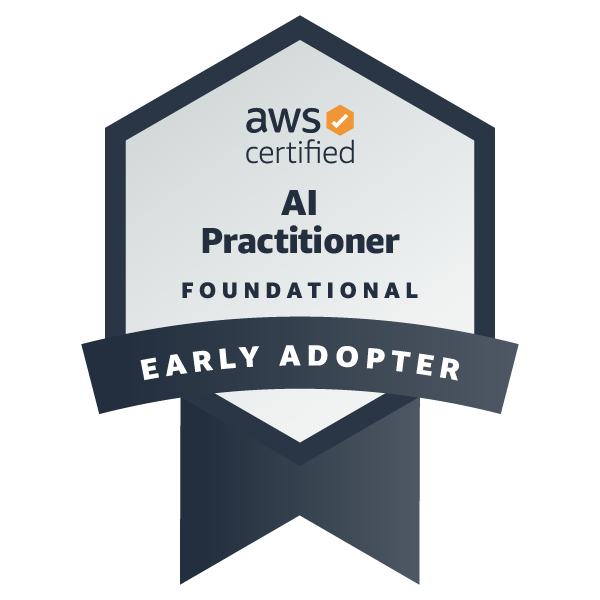

## Welcome to my profile

I'm Gabriel Leite Bessa and I'm actually graduating in Computer Science at Federal University of Pelotas (in portuguese: UFPel) - RS - Brazil. Thanks to visit my github page, feel free to contribute.

    
    

 

    

        
        
        
        
        
        
    

     
    

        
        
        
        
    

 

    
    

 

    
    
    
    
    

 

    

